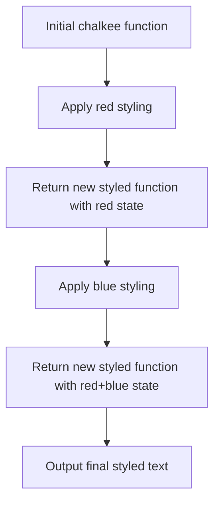

# Re-implementation of Chalkee in TypeScript with Vite and Template Chain Support

## Overview

This document outlines the design for re-implementing the popular `chalk` library as `chalkee` in TypeScript using Vite as the build tool. The implementation will focus on providing advanced terminal styling capabilities with a specific emphasis on template literal chaining syntax that allows for complex color sequences in a single expression.

### Key Features to Implement

1. Template literal chaining syntax similar to:
   ```javascript
   red.b`red`.blue('blue').hex()``.bg.green`green bg but hex color text`.red`red bg`.r`reset text`
   ```


2. Support for all standard chalk features:
   - Basic colors (red, blue, green, etc.)
   - Background colors (bgRed, bgBlue, etc.)
   - Modifiers (bold, italic, underline, strikethrough, dim, etc.)
   - Hex color support
   - RGB color support
   - Chaining capabilities
   - Template literal and regular function call support
   - Shorthand aliases (b for bold, i for italic, u for underline, s for strikethrough, d for dim)
   - Auto-spacing with `.as` modifier
   - Environment variable support (NO_COLOR, FORCE_COLOR, etc.)
   - Tree-shaking for minimal bundle sizes
   - Plugin architecture for extensibility


## System Architecture

### Core Components

1. **Styler Engine**
   - Responsible for applying ANSI escape codes to text
   - Handles color conversion (hex, RGB, named colors)
   - Manages state for chained operations

2. **Template Literal Handler**
   - Processes tagged template literals
   - Interpolates values within templates
   - Maintains chain state between calls

3. **Color Registry**
   - Stores available colors and their ANSI codes
   - Provides utilities for color manipulation
   - Supports dynamic color registration

4. **Chain State Manager**
   - Maintains the current styling state across chained calls
   - Tracks applied colors, background colors, and modifiers
   - Handles state merging when chaining
   - Manages auto-spacing state with `.as` modifier

5. **Plugin System**
   - Allows for modular extension of functionality
   - Enables tree-shaking of unused features
   - Supports custom color definitions

### Data Models

#### Color Definition
| Property | Type | Description |
|----------|------|-------------|
| name | string | The name of the color |
| ansiCode | number | The ANSI code for the color |
| type | 'foreground' \| 'background' | Whether the color is for text or background |

#### Style Chain State
| Property | Type | Description |
|----------|------|-------------|
| colors | ColorDefinition[] | List of applied foreground colors |
| modifiers | string[] | List of applied modifiers |
| backgroundColors | ColorDefinition[] | List of applied background colors |
| isOpen | boolean | Whether the chain is currently open |
| previousStyles | StyleChainState | Reference to previous chain state for nested chaining |
| autoSpacing | boolean | Whether auto-spacing is enabled for the next element |

## API Design

### Main Interface

The main interface will be a function that can be called in multiple ways:

```typescript
// Function call
chalkee.red('Hello World')

// Template literal
chalkee.red`Hello World`

// Chained calls
chalkee.red.bgBlue.bold('Hello World')

// Template literal chaining
chalkee.red`red text`.blue`blue text`

// Shorthand aliases
chalkee.red.b`bold red`.blue`blue text`

// Mixed usage
chalkee.red.b`red bold`.blue('blue regular').hex('#ff0000')`hex text`

// Complex chaining as specified in requirements
chalkee.red.b`red`.blue('blue').hex()``.bg.green`green bg but hex color text`.red`red bg`.r`reset text`

// Auto-spacing with .as
chalkee.red`red`.as.blue`blue`.as.green`green` // Adds spaces between segments
```

### Core Methods

| Method | Parameters | Description |
|--------|------------|-------------|
| red | (text: string) \| (strings: TemplateStringsArray, ...values: any[]) | Applies red color to text |
| blue | (text: string) \| (strings: TemplateStringsArray, ...values: any[]) | Applies blue color to text |
| green | (text: string) \| (strings: TemplateStringsArray, ...values: any[]) | Applies green color to text |
| yellow | (text: string) \| (strings: TemplateStringsArray, ...values: any[]) | Applies yellow color to text |
| bgRed | (text: string) \| (strings: TemplateStringsArray, ...values: any[]) | Applies red background color |
| bgBlue | (text: string) \| (strings: TemplateStringsArray, ...values: any[]) | Applies blue background color |
| bold | (text: string) \| (strings: TemplateStringsArray, ...values: any[]) | Applies bold styling |
| italic | (text: string) \| (strings: TemplateStringsArray, ...values: any[]) | Applies italic styling |
| underline | (text: string) \| (strings: TemplateStringsArray, ...values: any[]) | Applies underline styling |
| strikethrough | (text: string) \| (strings: TemplateStringsArray, ...values: any[]) | Applies strikethrough styling |
| dim | (text: string) \| (strings: TemplateStringsArray, ...values: any[]) | Applies dim styling |
| hex | (color: string) => (text: string) \| (strings: TemplateStringsArray, ...values: any[]) | Applies hex color |
| rgb | (r: number, g: number, b: number) => (text: string) \| (strings: TemplateStringsArray, ...values: any[]) | Applies RGB color |
| reset | (text: string) \| (strings: TemplateStringsArray, ...values: any[]) | Resets all styling |
| b | (text: string) \| (strings: TemplateStringsArray, ...values: any[]) | Shorthand for bold |
| i | (text: string) \| (strings: TemplateStringsArray, ...values: any[]) | Shorthand for italic |
| u | (text: string) \| (strings: TemplateStringsArray, ...values: any[]) | Shorthand for underline |
| s | (text: string) \| (strings: TemplateStringsArray, ...values: any[]) | Shorthand for strikethrough |
| d | (text: string) \| (strings: TemplateStringsArray, ...values: any[]) | Shorthand for dim |
| r | (text: string) \| (strings: TemplateStringsArray, ...values: any[]) | Shorthand for reset |
| as | (text: string) \| (strings: TemplateStringsArray, ...values: any[]) | Adds automatic spacing between chained elements |

### Chaining Implementation

The chaining mechanism will work by returning a new styled function after each call that maintains the current styling state:



Each chained function call will:
1. Apply its styling to the provided text
2. Return a new function that maintains the accumulated styling state
3. Support both template literal and regular function call syntax
4. Allow mixing of different call types in the same chain

## Implementation Details

### Template Literal Processing

The system will handle template literals by implementing a tagged template function:

1. Parse the template strings and values
2. Apply the current style state to each part
3. Concatenate the styled parts
4. Return a new styled function that maintains the chain

For regular function calls:
1. Apply the current style state to the provided string
2. Return a new styled function that maintains the chain
3. Handle value interpolation for non-string types

The processor will support both call patterns seamlessly within the same chain.

### Auto-Spacing with `.as`

The `.as` modifier will automatically add spaces between chained elements:

1. When `.as` is encountered, insert a space before the next styled segment
2. Maintain the styling state of the previous segment
3. Continue the chain with the new element

Example:
```javascript
chalkee.red`red`.as.blue`blue`.as.green`green`
// Results in: "red blue green" with appropriate colors
```

### ANSI Code Management

ANSI escape codes will be managed through a registry system:

- Foreground colors: `\x1b[3xm` where x is the color code
- Background colors: `\x1b[4xm` where x is the color code
- Modifiers: `\x1b[1m` for bold, `\x1b[3m` for italic, etc.
- Reset: `\x1b[0m`

### Tree-shaking Support

To support tree-shaking, the implementation will:

1. Use ES modules with named exports
2. Allow selective importing of individual colors/modifiers
3. Provide separate entry points for different feature sets
4. Implement a plugin system for optional features

### Plugin Architecture

Plugins will be able to extend the core functionality by:

1. Registering new colors
2. Adding new modifiers
3. Extending the template literal processor
4. Providing custom styling functions

## Build Process with Vite

### Configuration

The Vite configuration will:

1. Target Node.js environment for terminal usage
2. Generate both ESM and CJS bundles
3. Create TypeScript declaration files
4. Optimize for tree-shaking
5. Support multiple entry points for selective importing
6. Enable minification for production builds

### Output Structure

```
dist/
├── index.mjs          # Main ESM bundle
├── index.cjs          # Main CJS bundle
├── index.d.ts         # TypeScript declarations
├── index.full.mjs     # Full feature ESM bundle
├── index.full.cjs     # Full feature CJS bundle
├── index.minimal.mjs  # Minimal ESM bundle
├── index.minimal.cjs  # Minimal CJS bundle
├── colors/            # Individual color modules
│   ├── red.mjs
│   ├── blue.mjs
│   └── ...
├── modifiers/         # Individual modifier modules
│   ├── bold.mjs
│   ├── italic.mjs
│   └── ...
├── bg/                # Background color modules
│   ├── red.mjs
│   ├── blue.mjs
│   └── ...
└── plugins/           # Plugin modules
    ├── hex.mjs
    ├── rgb.mjs
    └── ...
```

This structure will support:
- Default import with all features
- Selective imports for specific colors/modifiers
- Minimal bundle for basic usage
- Full bundle with all features pre-loaded

## Performance Considerations

### Memory Efficiency

1. Cache frequently used ANSI codes
2. Reuse style objects where possible
3. Minimize string concatenation during chaining
4. Use efficient data structures for style tracking

### Runtime Optimization

1. Lazy initialization of color registries
2. Pre-compiled regex patterns for color parsing
3. Optimized template literal processing
4. Minimal overhead for simple single-color usage

## Testing Strategy

### Unit Tests

1. Individual color application
2. Template literal processing
3. Chaining functionality
4. Edge cases and error handling

### Integration Tests

1. Complex chaining scenarios
2. Cross-platform compatibility
3. Performance benchmarks
4. Bundle size verification

## Compatibility Requirements

### Node.js Versions

- Support Node.js 14+ (ESM support)
- Maintain compatibility with CommonJS through dual packages

### Terminal Support

- Standard ANSI terminal support
- Windows command prompt compatibility
- Popular terminal emulators (iTerm2, Hyper, etc.)

### TypeScript Support

- Full TypeScript typings
- Strict typing for all APIs
- Generic support for template literal types

### Environment Variables

- NO_COLOR support (disable all colors)
- FORCE_COLOR support (force color output)
- COLORTERM support (16m color detection)
- TERM support (basic color detection)

## Security Considerations

1. Input validation for color codes
2. Sanitization of user-provided text
3. Prevention of injection attacks through ANSI codes
4. Safe handling of special characters in template literals

## Future Extensibility

1. Support for 256-color mode
2. True color (16 million colors) support
3. Custom theme definitions
4. Integration with logging libraries
5. Browser-compatible version for devtools
6. Plugin architecture for custom modifiers
7. Advanced color manipulation functions (lighten, darken, mix)
8. Support for named CSS colors
9. Gradient text support
10. Animation support for blinking, fading effects
11. Extended modifier support (overline, blink, reverse, etc.)